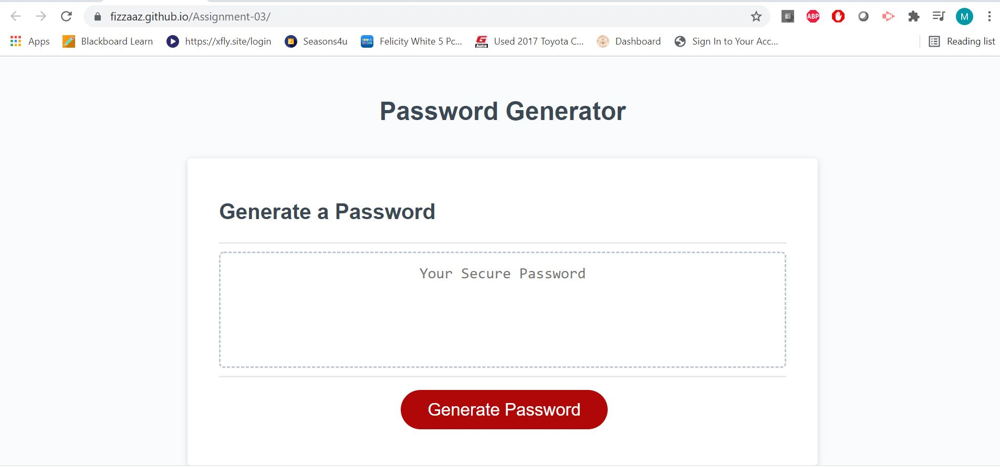

<h1>Password Generator</h4>
<h4>Designed and coded by <a href="https://github.com/fizzaaz">FIZZA ZAIDI</a></h4>
This project was designed as a homework assignment for UT Austin coding bootcamp.
This application emphasizes the use of Javascript to generate a random, secure password for the user.
 
<h2>Getting Started</h2>
This project has been deployed to GitHub Pages. To get this project up and running, you can follow the deployment link. Or, download the sources files to use this as a template.
 
 
<ul>
  <li><a href="https://github.com/fizzaaz/Assignment-03"> GitHub Repository</a></li>
  <li><a href="https://fizzaaz.github.io/Assignment-03/">Deployed Github IO</a></li>
  <li><a href="https://drive.google.com/file/d/1UjLUk5wtVuOe4X4ocCfWyF-hh__2oLTJ/view/">Full Demo Video</a></li>

</ul>
 
 

<h3>Prerequisites</h3>
To install this application, you will need a text editor. I recommend Visual Studio Code.
 
<h3>Installing</h3>
To install this code, download the zip file, or use GitHub's guidelines to clone the repository.
 
<h3>Introduction</h3>
In this projects, HTML and CSS and Javascript documents create a random password generator.
This project emphasizes the use of using Javascript to make dynamic changes to an HMTL document.
<h3>Structure & Features</h3>
<h4>Basic Structure</h4>
<ol>
  <li><h5>Generate Button</h5></li>
  This will send the user a series of prompts and confirms. After user data is collected, a random password will be generated using Javascript.
  <li><h5>Textarea</h5></li>
  This textarea will display the users password once it is generated.
  </ol>
  
  <h4>Features</h4>
<ol>
  <li><h5>HTML </h5></li>
This page has one HTML file that contains basic user input items and buttons with divs and ids.
  <li><h5>CSS Page  </h5></li>
This page contains one styling file for centering and styling for html user input features.
  <li><h5>Media Queries</h5></li>
    To make this page responsive.
<li><h5> Javascript</h5> </li>
That page includes variables, event listeners ,if/else statements, functions.
</ol>
<h3>Project Requirements</h3>
<ul>
<li>WHEN user click the button to generate a password THEN the user must be presented with a series of prompts for password criteria.</li>
<li>WHEN user prompted for password criteria THEN user selects which criteria to include in the password</li>
<li>WHEN user prompted for the length of the password THEN user chooses a length of at least 8 characters and no more than 128 characters</li>
<li>WHEN user prompted for character types to include in the password THEN the user choose lowercase, uppercase, numeric, and/or special characters</li>
<li>WHEN the user answer each prompt THEN the input should be validated and at least one character type should be selected</li>
<li>WHEN all prompts are answered THEN a password is generated that matches the selected criteria</li>
<li>WHEN the password is generated THEN the password is either displayed in an alert or written to the page</li>
